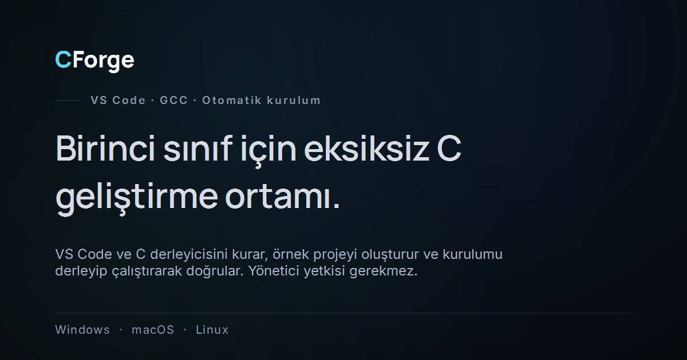

# CForge — İndirme

**Türkçe** · [English](README.en.md)

CForge, C dersi için gereken ortamı bilgisayarına tek işlemde kurar: VS Code,
C derleyicisi, gerekli eklentiler ve çalışmaya hazır bir örnek proje. Yönetici
yetkisi gerekmez.

**[→ Son sürümü indir](https://github.com/mtvrkan/CForge-releases/releases/latest)**

Tanıtım sayfası: [cforge.mtvrkan.com](https://cforge.mtvrkan.com)



---

## Hangisini indireceğim?

| Sistemin | Dosya |
| --- | --- |
| Windows 10/11 | `CForge-windows-online-<sürüm>.zip` |
| Windows, internet zayıf veya kısıtlıysa | `CForge-windows-offline-<sürüm>.exe` |
| Mac (Apple Silicon — M1, M2, M3, M4) | `CForge-macos-arm64-<sürüm>.zip` |
| Mac (Intel) | `CForge-macos-x64-<sürüm>.zip` |
| Linux (x64) | `CForge-linux-x64-<sürüm>.tar.gz` |

**Hangi Mac'e sahip olduğunu bilmiyorsan:**  → Bu Mac Hakkında → "Yonga" satırında
*Apple* yazıyorsa arm64, *Intel* yazıyorsa x64.

**online / offline farkı:** online sürüm VS Code'u ve derleyiciyi kurulum
sırasında indirir (küçük dosya, internet gerekir). offline sürüm her şeyi
içinde taşır (büyük dosya, kurulum sırasında internet gerekmez) — kampüs ağı
indirmeleri engelliyorsa bunu kullan.

## Nasıl çalıştırılır

**Windows** — `.zip`'i çıkar, içindeki `CForge.exe`'yi çalıştır. offline
sürümde tek bir `.exe` var, doğrudan çalıştır.
Windows "bilinmeyen yayıncı" uyarısı verirse: *Ek bilgi* → *Yine de çalıştır*.

**macOS** — `.zip`'i çıkar, `CForge.app`'i **sağ tık → Aç** ile başlat (ilk
açılışta çift tıklama macOS tarafından engellenir).

**Linux** — arşivi çıkar ve çalıştır:

```bash
tar -xzf CForge-linux-x64-*.tar.gz
./CForge/CForge
```

## Kurulum bittiğinde

VS Code açılır ve `ilkprojem.c` hazır bekler. **F5** programı derler ve
çalıştırır. Kurulum, kendi kurduğu ortamı gerçekten derleyip çalıştırarak
doğrular — yani "tamamlandı" yazıyorsa çalışıyor demektir.

Proje klasörün: `Belgeler/algoritma-1` (macOS ve Linux'ta `Documents`).

## Bir sorun çıkarsa

CForge hata durumunda ne olduğunu düz Türkçe anlatan bir rapor üretir ve
kopyalanabilir hâlde gösterir. O raporu dersin sorumlusuna ilet — antivirüs
silmesi, yarıda kalan kurulum, eksik derleyici ve indirmeyi engelleyen ağ
durumlarını ayrı ayrı tanır.

Yeniden denemek güvenlidir: CForge kaldığı yerden devam eder, kurulu olanı
tekrar kurmaz.

---

Bu depo yalnızca indirme çıktılarını ve tanıtım sayfasını barındırır.
