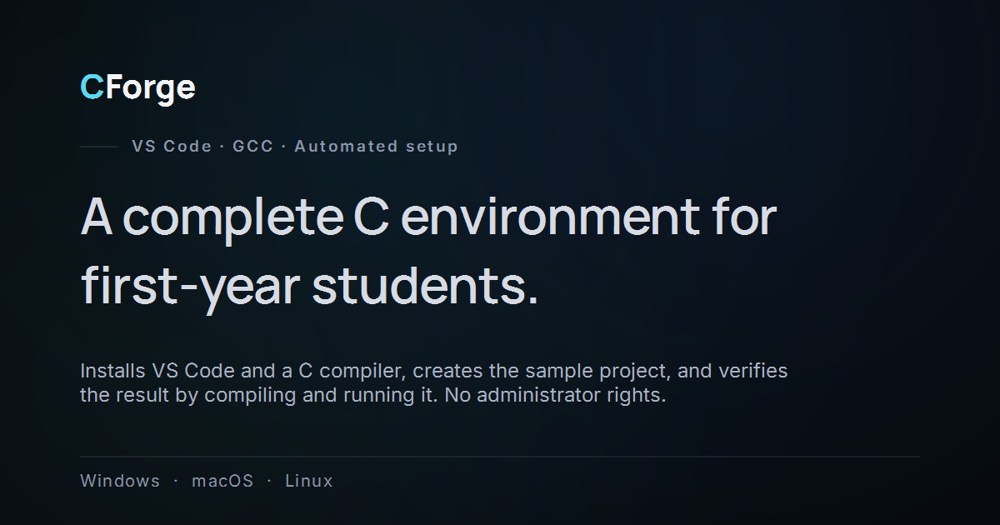

# CForge — Downloads

**English** · [Türkçe](README.tr.md)

CForge sets up everything your C course needs in a single operation: VS Code, a
C compiler, the required extensions, and a sample project ready to run. No
administrator rights needed.

**[→ Download the latest release](https://github.com/mtvrkan/CForge-releases/releases/latest)**

Product page: [cforge.mtvrkan.com](https://cforge.mtvrkan.com)



---

## Which one do I download?

| Your system | File |
| --- | --- |
| Windows 10/11 | `CForge-windows-online-<version>.exe` |
| Windows, on a weak or restricted connection | `CForge-windows-offline-<version>.exe` |
| Mac (Apple Silicon — M1, M2, M3, M4) | `CForge-macos-arm64-<version>.zip` |
| Mac (Intel) | `CForge-macos-x64-<version>.zip` |
| Linux (x64) | `CForge-linux-x64-<version>.tar.gz` |

**Not sure which Mac you have:**  → About This Mac → if the *Chip* line says
*Apple*, take arm64; if it says *Intel*, take x64.

**online vs offline:** the online build downloads VS Code and the compiler
during setup (small file, needs a connection). The offline build carries
everything inside it (large file, needs no connection during setup) — use it if
your campus network blocks downloads.

## How to run it

**Windows** — run the `.exe` you downloaded; there is nothing to install.
It may take a few seconds to open the first time.
**If you see "Windows protected your PC"**, that is expected: CForge is not a
signed application, and Windows shows this for every program it does not
recognise. Click **More info** → **Run anyway**.

**macOS** — extract the `.zip`, then **right-click → Open** on `CForge.app`
(macOS blocks a double-click on first launch).

**Linux** — extract and run:

```bash
tar -xzf CForge-linux-x64-*.tar.gz
./CForge/CForge
```

## When setup finishes

VS Code opens with `ilkprojem.c` ready. **F5** compiles and runs it. Setup
verifies the environment it just built by compiling and running a program in it
— so if it says it finished, it works.

Your project folder: `Documents/algoritma-1`.

## If something goes wrong

CForge produces a report that explains in plain language what happened, ready to
copy. Send it to your instructor — it tells apart an antivirus deletion, a
cancelled installer, an incomplete toolchain and a network that blocks
downloads.

Trying again is safe: CForge continues where it left off and does not reinstall
what is already there.

---

This repository holds the download artefacts and the product page only.
